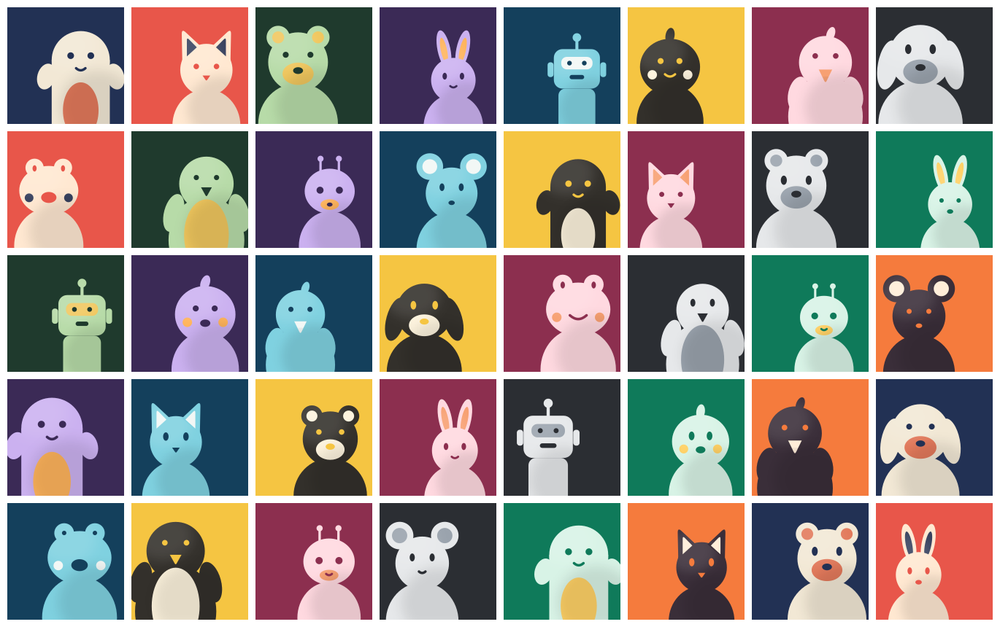
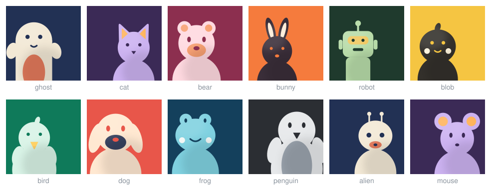
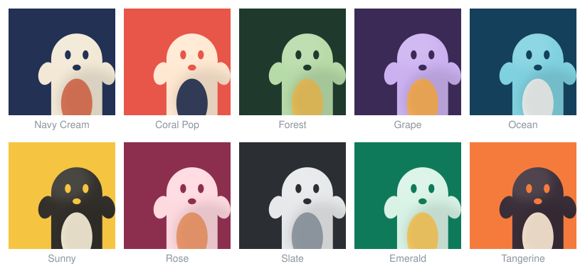

# Mascot Avatars



Procedural SVG mascot avatars following the design rules of [ip-as-logo-skill](https://github.com/s1dashu/ip-as-logo-skill): one bold silhouette built from 6–10 rounded shapes, at most two colors on a solid background, subtle 8–12% internal shading, and the character emerging from a lower corner filling 75–85% of the canvas. Deterministic — the same seed always produces the same avatar. Zero dependencies, no AI, works in Node and the browser.

This repository is a fork of the original skill: the AI-agent instruction document lives in [SKILL.md](SKILL.md), and this package is a hand-coded implementation of the same design system.

## Usage

### Node

```js
const { renderAvatar } = require("mascot-avatars");

const svg = renderAvatar({ seed: "ada@example.com" });
require("fs").writeFileSync("avatar.svg", svg);
```

### Browser

```html
<script src="avatar.js"></script>
<script>
  const svg = MascotAvatar.renderAvatar({ seed: "ada" });
  document.getElementById("avatar").innerHTML = svg;
</script>
```

## API

### `renderAvatar(opts)` → SVG string (512×512 viewBox)

| Option    | Default    | Values |
|-----------|------------|--------|
| `seed`    | `"avatar"` | any string; same seed → same avatar |
| `species` | `"auto"`   | `ghost`, `cat`, `bear`, `bunny`, `robot`, `blob`, `bird`, `dog`, `frog`, `penguin`, `alien`, `mouse`, or `"auto"` (picked from seed) |
| `palette` | `"auto"`   | a palette name from `PALETTES`, or `"auto"` |
| `mode`    | `"two"`    | `"two"` (two-color) or `"mono"` (monochrome) |
| `corner`  | `"auto"`   | `"left"`, `"right"`, or `"auto"` |

Also exported: `PALETTES` (array of `{ name, bg, p, s }`), `SPECIES_NAMES`, `SIZE`.

Each seed also picks face-trait variants (oval vs. round eyes, oval vs. smile mouth) and small per-species jitters, so avatars vary beyond the species × palette grid — about 960 clearly distinct looks.

## Species



## Palettes

The same character across all ten palettes:



## Legible at 32px

The design rules exist so avatars survive icon sizes — these are rendered at actual 32px:


## Monochrome mode

`mode: "mono"` collapses the accent color into the body for a stricter one-color mark:


## Demo

Open `index.html` in a browser for an interactive playground — seed input, all controls, live 64px/32px previews, and SVG/PNG export. (Regenerate the images above with `node tools/showcase.js`.)

## License

MIT — see [LICENSE](LICENSE). Original skill by [s1dashu](https://github.com/s1dashu).
